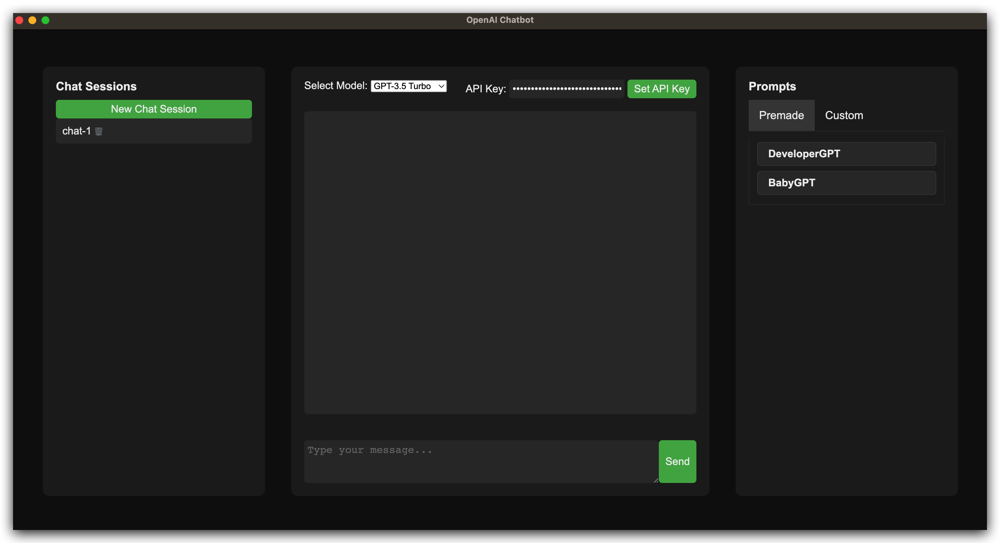

# OpenAI Chat

This is a simple Electron-based chat application that uses the OpenAI API to create interactive chat sessions with an AI language model.

## Demo

<p align="center">

<p align="center">


## Features
- Create and manage multiple chat sessions with unique names.
- Customize the language model and other settings for each chat session.
- Easily send messages and receive responses from the AI model.
- Simple and user-friendly interface for easy use.
- Create custom prompts for the AI model to generate responses from.
- Use Premade Prompts to generate responses from a list of pre-made prompts.
- Save chat sessions between sessions.

## Prerequisites
Before you can run the application, make sure you have the following installed:
- Node.js
- npm (usually comes bundled with Node.js)
- Api Key found here: [api-key](https://platform.openai.com/account/api-keys)

## Installation
1. Clone this repository to your local machine:
```bash
git clone https://github.com/stangirard/electron-gpt.git
```
2. Navigate to the project directory:
```bash  
cd openai-chat
```
3. Install the required dependencies:
```bash
npm install
```
4. Start the application:
```bash
npm start
```


## Usage
1. Launch the application.
2. Enter your OpenAI API key and click "Set API Key".
3. Click "New Chat Session" to create a new chat session.
4. Type a message in the input field and press "Enter" or click "Send" to send the message.
5. The AI model will respond to your message and display it in the chat window.
